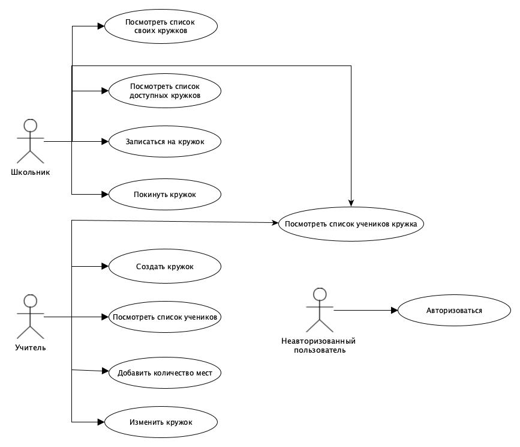
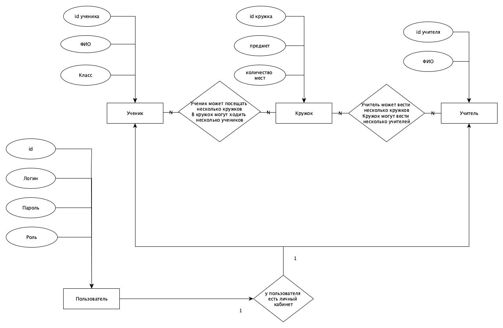

# Шкужок

## Краткое описание проекта
В школах учителя часто организовывают кружки (математика, рисование, волейбол). 
Удобного приложение для просмотра списка кружков, их расписания, а также записи в понравивишийся кружок -- нет. 
Идея проекта заключается в создании приложения, которое позволит облегчить взаимодействие ученика с школьной системой кружков.

## Краткое описание предметной области
Любой преподаватель может создать неограниченное количество кружков по разным темам (и для разных возрастных групп). У любого ученика есть возможность просмотра списка всех кружков, их краткого описание, времени занятий и количества свободных мест. Ученик в любой момент может добавиться в новый кружок и выйти из старого. 

## Краткий обзор существующих решений
Аналогом такого приложения является "Расписание МГТУ", в котором студент может посмотреть расписание любой группы ВУЗа, однако возможность какой-либо записи, естественно, отсутствует.

## Краткое обоснование целесообразнсти и актуальности проекта
Актуальность проекта заключается в необходимости удобного приложения для школьников. Целесообразность проекта заключается в том, что приложение отвечает требования долговечности, простоты использования и надежности.

## Use-Case - диаграмма

## ER-диаграмма сущностей

## Архитектурные характеристики
1. Безопасности (отсутсвтие выхода в интернет)